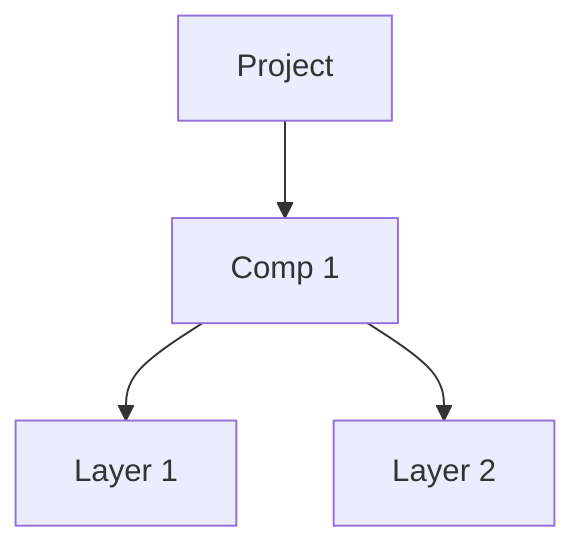

# Command Line Tools

AEP Parser provides three command-line utilities for working with After Effects project files. These tools are installed automatically when you install the package.

## Installation

All CLI tools are available after installing aep_parser:

```bash
pip install aep_parser
```

---

## aep-validate

Compares parsed AEP values against expected JSON values (from ExtendScript export) to validate parsing correctness.

### Usage

```bash
aep-validate project.aep expected.json
aep-validate project.aep expected.json --verbose
aep-validate project.aep expected.json --category layers
```

### Arguments

| Argument | Description |
|----------|-------------|
| `aep_file` | Path to the .aep file to parse |
| `json_file` | Path to the expected JSON file (exported from ExtendScript) |

### Options

| Option | Description |
|--------|-------------|
| `--verbose`, `-v` | Show all differences in detail |
| `--category`, `-c` | Filter results by category: `project`, `composition`, `layers`, `markers`, `folders`, `renderqueue` |

### Example

```bash
# Basic validation
aep-validate my_project.aep expected_output.json

# Verbose output showing all differences
aep-validate my_project.aep expected_output.json --verbose

# Only show layer-related differences
aep-validate my_project.aep expected_output.json --category layers

# Only show render queue differences
aep-validate my_project.aep expected_output.json --category renderqueue
```

### Output

The tool reports:

- ✓ Number of matching values
- ✗ Number of mismatches with details
- Differences categorized by type (project, composition, layers, markers, folders, renderqueue)

---

## aep-compare

Compares two After Effects project files (.aep or .aepx) and reports differences at the byte level.

### Usage

```bash
aep-compare file1.aep file2.aep
aep-compare file1.aepx file2.aepx
aep-compare file1.aep file2.aep --json
aep-compare file1.aep file2.aep --filter ldta
aep-compare file1.aep file2.aep --format aepx
```

### Arguments

| Argument | Description |
|----------|-------------|
| `file1` | Path to the first .aep or .aepx file |
| `file2` | Path to the second .aep or .aepx file |

### Options

| Option | Description |
|--------|-------------|
| `--format` | File format: `auto` (default), `aep`, or `aepx`. Auto-detects from extension |
| `--json` | Output differences in JSON format |
| `--filter` | Filter differences by chunk type pattern (case-insensitive, e.g., `ldta`, `LIST:Layr`) |

### Example

```bash
# Compare two AEP files
aep-compare original.aep modified.aep

# Compare AEPX (XML) files
aep-compare version1.aepx version2.aepx

# Export differences as JSON
aep-compare original.aep modified.aep --json > diff.json

# Only show differences in layer data (ldta) chunks
aep-compare original.aep modified.aep --filter ldta

# Filter by LIST chunk type
aep-compare original.aep modified.aep --filter "LIST:Layr"
```

### Output

The tool reports for each difference:

- **Chunk path**: The hierarchical location in the file structure
- **Byte offset**: Position within the chunk
- **Hex values**: Side-by-side comparison (e.g., `0x2A vs 0x3B`)
- **Binary values**: Bit-level view (e.g., `00101010 vs 00111011`)
- **Bit position**: If only one bit differs, shows which bit (7 to 0, left to right)

Example output:
```
Layr/ldta:
  Offset   38 (0x0026): 0x00 (00000000) vs 0x01 (00000001), bit 0
  Offset   42 (0x002A): 0x64 (01100100) vs 0x32 (00110010)
```

---

## aep-visualize

Visualizes an After Effects project structure in various output formats.

### Usage

```bash
aep-visualize project.aep
aep-visualize project.aep --format dot > project.dot
aep-visualize project.aep --format mermaid
aep-visualize project.aep --depth 2
aep-visualize project.aep --no-properties
```

### Arguments

| Argument | Description |
|----------|-------------|
| `aep_file` | Path to the .aep file to visualize |

### Options

| Option | Description |
|--------|-------------|
| `--format`, `-f` | Output format: `text` (default), `dot`, `mermaid`, `json` |
| `--depth`, `-d` | Maximum depth to traverse (default: unlimited) |
| `--no-properties` | Exclude property details from output |
| `--output`, `-o` | Output file (default: stdout) |

### Output Formats

#### Text (default)
ASCII tree representation in the terminal:

```
📦 my_project.aep {'ae_version': '25.2x26', 'bits_per_channel': 'BPC_8', 'frame_rate': 30.0}
├── 🎬 Comp 1 {'size': '1920x1080', 'duration': '10.00s', 'frame_rate': 30.0, 'layers_count': 2}
│   ├── 📄 Background {'type': 'SOLID'}
│   │   └── 🔄 Transform {'properties': 5}
│   └── 📄 Text Layer {'type': 'TEXT'}
├── 🎞️ image.png {'asset_type': 'image', 'size': '1920x1080'}
└── 🎯 Render Queue {'items': 1}
    └── 📋 Item 1 {'output_modules': 1, 'comp': 'Comp 1'}
        └── 💾 Output Module {'file': 'output.mov', 'template': 'Lossless'}
```

The visualization includes:

- **📦 Project**: Root project with version and settings
- **📁 Folder**: Folder items containing other items
- **🎬 Composition**: Compositions with layers
- **🎞️ Footage**: Footage items (images, video, solids)
- **📄 Layer**: Layers within compositions
- **🔄 Transform**: Transform property groups
- **📂 PropertyGroup**: Property groups (effects, text properties)
- **⚙️ Property**: Individual properties
- **🎯 RenderQueue**: Render queue (if items present)
- **📋 RenderQueueItem**: Individual render queue items
- **💾 OutputModule**: Output module settings

#### DOT (Graphviz)
Generate DOT format for rendering with Graphviz:

```bash
aep-visualize project.aep --format dot > project.dot
dot -Tpng project.dot -o project.png
```

#### Mermaid
Generate Mermaid flowchart syntax for embedding in Markdown:

```bash
aep-visualize project.aep --format mermaid
```

Output can be embedded in GitHub README or documentation:

````markdown

````

#### JSON
Structured JSON output for custom processing:

```bash
aep-visualize project.aep --format json | python process.py
```

### Examples

```bash
# Quick overview of project structure
aep-visualize my_project.aep

# Generate PNG diagram
aep-visualize my_project.aep --format dot | dot -Tpng -o structure.png

# Shallow view (only top-level items)
aep-visualize my_project.aep --depth 1

# Structure only, no property details
aep-visualize my_project.aep --no-properties

# Save Mermaid diagram to file
aep-visualize my_project.aep --format mermaid --output diagram.md
```

---

## Common Use Cases

### Debugging Parse Differences

When developing or troubleshooting the parser:

```bash
# Create reference JSON using scripts/jsx/export_project_json.jsx, then validate
aep-validate test_project.aep reference.json --verbose
```

### Reverse Engineering Binary Format

When investigating unknown binary fields:

```bash
# Compare two files with known single difference
aep-compare baseline.aep with_auto_orient.aep --filter ldta
```

### Documentation Generation

Generate project structure diagrams for documentation or debugging

```bash
# Mermaid for GitHub/GitLab
aep-visualize project.aep --format mermaid > docs/structure.md

# PNG for general documentation
aep-visualize project.aep --format dot | dot -Tpng -o docs/structure.png
```
