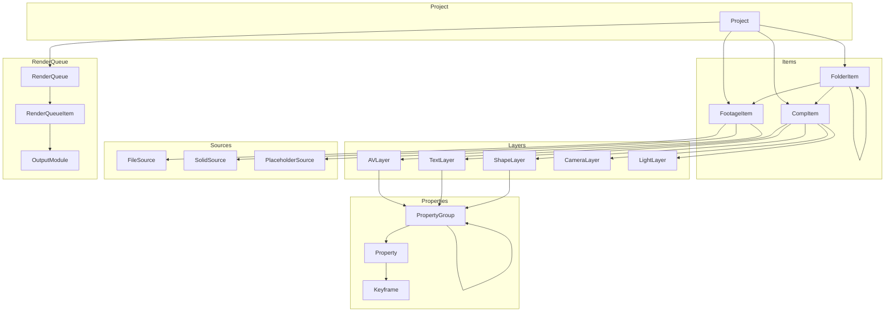

# AEP Parser Documentation

Welcome to the AEP Parser documentation! This library provides a Python interface for parsing Adobe After Effects project files (.aep).

## About

AEP Parser is a Python library that parses Adobe After Effects project files (.aep), which are binary files encoded in RIFX format. The library uses [Kaitai Struct](https://kaitai.io/) to parse the binary format and provides a clean, typed Python API to access project data.

## Installation

```bash
pip install aep-parser
```

## Quick Start

```python
from aep_parser import parse_project

# Parse an After Effects project file
project = parse_project("path/to/your/project.aep")

# Access project information
print(f"AE Version: {project.ae_version}")
print(f"Frame Rate: {project.frame_rate}")
print(f"Bits per Channel: {project.bits_per_channel}")

# Access project items
for item in project:
    print(f"Item: {item.name} ({type(item).__name__})")
```

## Features

- **Full Project Parsing**: Parse complete After Effects projects including compositions, footage, layers, and effects
- **Render Queue**: Access render queue items, render settings, and output module configurations
- **Type Safety**: Fully typed Python dataclasses for all AE objects
- **Comprehensive**: Support for layers, properties, effects, keyframes, markers, and more
- **Python 3.7+**: Compatible with Python 3.7 and above

## Key Concepts

### Project Structure

An After Effects project has a hierarchical structure:



### Data Model

The library provides dataclasses that mirror After Effects' object model:

- `Project`: Root project object
- `CompItem`, `FootageItem`, `FolderItem`: Project items
- `AVLayer`, `TextLayer`, `ShapeLayer`, etc.: Layer types
- `Property`, `PropertyGroup`: Layer properties
- `Keyframe`, `MarkerValue`: Animation data
- `FileSource`, `SolidSource`, `PlaceholderSource`: Footage sources
- `RenderQueue`, `RenderQueueItem`, `RenderSettings`, `OutputModule`: Render queue

## API Reference

Browse the [API Reference](api/index.md) for detailed documentation of all classes and methods.

## Contributing

Contributions are welcome! See the [Contributing Guide](contributing.md) to get started, or visit the [GitHub repository](https://github.com/forticheprod/aep_parser) for more information.

## License

This project is licensed under the MIT License.
